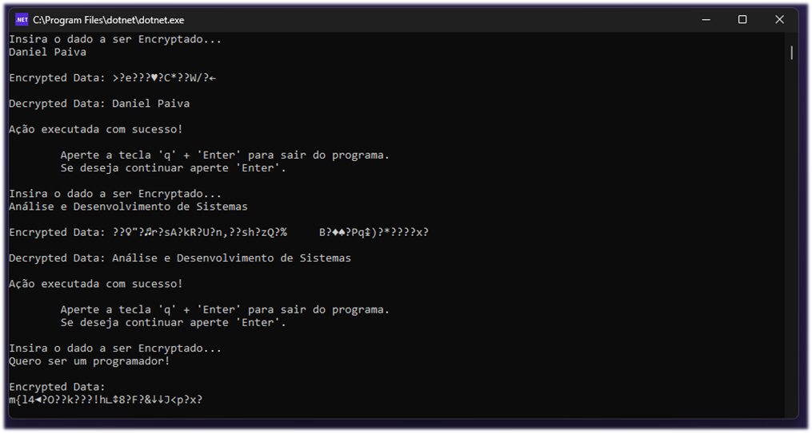

<h1 align="center"> 🎨 EncryptAesApp 😄</h1>

    

 <a href="#status">Status</a> • 
 <a href="#objective">Objective</a> •
 <a href="#installation">Installation</a> • 
 <a href="#technology">Technology</a> • 
 <a href="#author">Author</a> • 
 <a href="#licence">License</a>

<h2 align="center" id=status> 
	⌛ Concluded ⌛
</h2>

<h2 id=objective>📜 About</h2>
Project to explain cryptography to university students. 
Application to encrypt data using the AES encryption model. 
Made in .Net 6.

<h2 id=installation>✔️ Installation</h2>

1. Clone the repo.
2. Have the .Net SDK installed on the machine.
3. Open Visual Studio Code or Visual Studio 2022.
4. Debug the code.

<h2 id=technology>🧰 Technology</h2>

The following tools were used in the construction of the project:

- IDE: <a href="https://code.visualstudio.com/download">Visual Studio Code</a>
- SDK: <a href="https://dotnet.microsoft.com/pt-br/download/dotnet/6.0">.Net 6</a>

<h2 id=author>😎 Author</h2>

Developed by <a href="https://www.linkedin.com/in/danhpaiva/" target="_blank">Daniel Paiva</a>

<h2 id=licence>🆓 Licence</h2>

View the license for this project 
<a href="https://github.com/danhpaiva/EncryptAesNet-console-app-csharp/blob/main/LICENSE" target="_blank">MIT</a>
